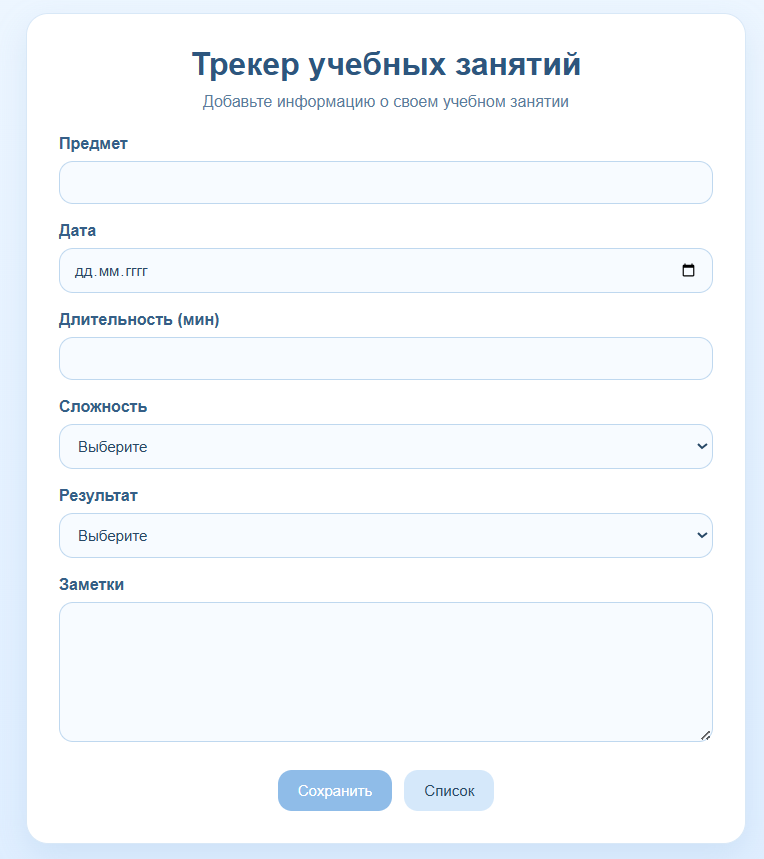

# Лабораторная работа №6 Обработка и валидация форм
Каварналы Анастасия IA2403

## Тема проекта: Веб-приложение для учета учебных заданий

Веб-приложение для учета учебных заданий, в котором пользователь может вводить информацию о занятии (предмет, дата, длительность, сложность, результат и заметки). Данные проходят валидацию, сохраняются в JSON-файл и отображаются на отдельной странице. Реализована сортировка записей для удобства просмотра

## Цель работы:

Освоить основные принципы работы с HTML-формами в PHP, включая отправку данных на сервер и их обработку, включая валидацию данных.

## Условия работы:

В рамках лабораторной работы необходимо разработать небольшое веб-приложение на PHP по выбранной теме.
В данной работе была выбрана тема «Трекер учебных заданий»

Приложение должно обеспечивать: 

- создание новой записи через HTML-форму;
- отправку данных методом `POST`;
- серверную обработку и валидацию данных;
- сохранение записей в файл в формате `JSON`;
- отображение всех записей в виде HTML-таблицы;
- сортировку данных по выбранным полям;
- расширяемую архитектуру валидации с использованием интерфейса

## Шаг 1. Определение модели данных

Для выбранной темы «Трекер учебных заданий» определены следующие данные, которые будут храниться в приложении:

- `subject` — название предмета (тип string);
- `study_date` — дата учебной сессии (тип date);
- `duration` — длительность занятия в минутах (тип number);
- `difficulty` — уровень сложности (тип enum: легко, средне, сложно);
- `result` — результат занятия (тип enum: выполнено, частично, нужно повторить);
- `notes` — заметки по занятию (тип text);
- `created_at` — дата и время создания записи (тип date);

Таким образом, модель данных соответствует требованиям задания:

- содержит более 6 полей;
- включает поле типа `string` (subject);
- включает поле типа `date` (study_date, created_at);
- включает поля типа `enum` (difficulty, result);
- включает поле типа `text` (notes)

### Используемые значения перечислений

**Сложность (difficulty):**

- Легко
- Средне
- Сложно

**Результат (result):**

- Выполнено
- Частично
- Нужно повторить

## Шаг 2. Создание HTML-формы

На данном этапе была разработана HTML-форма для добавления новой учебной сессии в приложение «Трекер учебных заданий».

Форма содержит все поля, предусмотренные моделью данных:

- название предмета;
- дата учебной сессии;
- длительность занятия;
- уровень сложности;
- результат;
- текстовые заметки

Передача данных осуществляется с использованием метода `POST`, что позволяет отправлять введенную информацию на сервер для последующей обработки

Для повышения удобства использования и предотвращения ввода некорректных данных была реализована базовая проверка на стороне клиента. В частности, применены следующие атрибуты HTML:

- `required` — для обязательных полей;
- `minlength` и `maxlength` — для ограничения длины текста;
- `min` и `max` — для числовых значений

Это позволяет проверить корректность части данных еще до отправки формы на сервер и улучшает удобство использования приложения

```php
<form action="save_session.php" method="POST" class="form">

    <div class="form-group">
        <label>Предмет</label>
        <input type="text" name="subject" required minlength="2" maxlength="100">
     </div>

    <div class="form-group">
        <label>Дата</label>
        <input type="date" name="study_date" required>
    </div>

    <div class="form-group">
        <label>Длительность (мин)</label>
        <input type="number" name="duration" required min="1" max="600">
    </div>

    <div class="form-group">
        <label>Сложность</label>
        <select name="difficulty" required>
            <option value="">Выберите</option>
            <option value="Легко">Легко</option>
            <option value="Средне">Средне</option>
            <option value="Сложно">Сложно</option>
        </select>
    </div>

    <div class="form-group">
        <label>Результат</label>
        <select name="result" required>
            <option value="">Выберите</option>
            <option value="Выполнено">Выполнено</option>
            <option value="Частично">Частично</option>
            <option value="Нужно повторить">Нужно повторить</option>
        </select>
    </div>

    <div class="form-group">
        <label>Заметки</label>
        <textarea name="notes" required minlength="5" maxlength="1000"></textarea>
    </div>

    <div class="actions">
        <button type="submit" class="btn">Сохранить</button>
        <a href="list_sessions.php" class="btn btn-secondary">Список</a>
    </div>
</form>
```



## Шаг 3. Обработка данных на сервере

Обработка формы выполняется в файле `save_session.php`

Этот файл выполняет следующие действия:

- принимает данные из массива `$_POST`;
- запускает серверную валидацию;
- при отсутствии ошибок сохраняет запись в файл `data.json`;
- выводит сообщение об успешном сохранении или список ошибок

Для хранения данных был выбран формат `JSON`, так как он удобен для чтения, обработки и последующего вывода записей

```php
<?php

require_once 'StudySessionValidator.php';

if ($_SERVER['REQUEST_METHOD'] !== 'POST') {
    header('Location: index.php');
    exit;
}

$validator = new StudySessionValidator();
$errors = $validator->validate($_POST);

if (!empty($errors)) {
    ?>
    <!DOCTYPE html>
    <html lang="ru">
    <head>
        <meta charset="UTF-8">
        <title>Ошибки</title>
        <link rel="stylesheet" href="styles.css">
    </head>
    <body>
        <div class="page">
            <div class="card">
                <h1>Ошибки</h1>

                <ul class="error-list">
                    <?php foreach ($errors as $error): ?>
                        <li><?php echo htmlspecialchars($error); ?></li>
                    <?php endforeach; ?>
                </ul>

                <div class="actions">
                    <a href="index.php" class="btn">Назад</a>
                </div>
            </div>
        </div>
    </body>
    </html>
    <?php
    exit;
}

$newSession = [
    'subject' => trim($_POST['subject']),
    'study_date' => trim($_POST['study_date']),
    'duration' => (int)$_POST['duration'],
    'difficulty' => trim($_POST['difficulty']),
    'result' => trim($_POST['result']),
    'notes' => trim($_POST['notes']),
    'created_at' => date('Y-m-d H:i:s')
];

$file = 'data.json';
$data = [];

if (file_exists($file)) {
    $content = file_get_contents($file);
    $decoded = json_decode($content, true);

    if (is_array($decoded)) {
        $data = $decoded;
    }
}

$data[] = $newSession;

file_put_contents($file, json_encode($data, JSON_PRETTY_PRINT | JSON_UNESCAPED_UNICODE));

?>
<!DOCTYPE html>
<html lang="ru">
<head>
    <meta charset="UTF-8">
    <title>Успешно</title>
    <link rel="stylesheet" href="styles.css">
</head>
<body>
    <div class="page">
        <div class="card success-card">
            <h1>Сохранено</h1>
            <p>Запись успешно добавлена</p>

            <div class="actions">
                <a href="index.php" class="btn">Добавить еще</a>
                <a href="list_sessions.php" class="btn btn-secondary">Посмотреть</a>
            </div>
        </div>
    </div>
</body>
</html>
```

**Пример данных в файле `data.json`**

```json
[
     {
        "subject": "PHP",
        "study_date": "2026-04-15",
        "duration": 90,
        "difficulty": "Средне",
        "result": "Нужно повторить",
        "notes": "Повторить тему \"Объектно-Ориентированное Программирование в PHP\"",
        "created_at": "2026-04-15 14:03:41"
    }
]
```

## Шаг 4. Вывод данных

Для вывода сохранённых записей был создан отдельный PHP-скрипт `list_sessions.php`

Этот файл считывает данные из файла `data.json`, преобразует их в массив и отображает в виде HTML-таблицы

В таблице выводятся все добавленные учебные занятия: предмет, дата, длительность, сложность, результат, заметки и дата создания записи. Для более удобного восприятия информация оформлена с помощью CSS-стилей

Также была реализована сортировка данных по нескольким полям:

- по дате;
- по длительности;
- по предмету

**Чтение данных из файла**

```php
<?php

$file = 'data.json';
$data = [];

if (file_exists($file)) {
    $content = file_get_contents($file);
    $decoded = json_decode($content, true);

    if (is_array($decoded)) {
        $data = $decoded;
    }
}
?>
```

**Сортировка данных**

```php
<?php
$sort = $_GET['sort'] ?? 'study_date';

if ($sort === 'duration') {
    usort($data, fn($a, $b) => $a['duration'] <=> $b['duration']);
} elseif ($sort === 'subject') {
    usort($data, fn($a, $b) => strcmp($a['subject'], $b['subject']));
} else {
    usort($data, fn($a, $b) => strcmp($a['study_date'], $b['study_date']));
}
?>
```

**Вывод таблицы**

```php
<table>
    <tr>
        <th>Предмет</th>
        <th>Дата</th>
        <th>Минуты</th>
        <th>Сложность</th>
        <th>Результат</th>
        <th>Заметки</th>
        <th>Создано</th>
    </tr>

    <?php foreach ($data as $item): ?>
        <tr>
            <td><?= htmlspecialchars($item['subject']) ?></td>
            <td><?= htmlspecialchars($item['study_date']) ?></td>
            <td><?= htmlspecialchars($item['duration']) ?></td>
            <td><?= htmlspecialchars($item['difficulty']) ?></td>
            <td><?= htmlspecialchars($item['result']) ?></td>
            <td><?= htmlspecialchars($item['notes']) ?></td>
            <td><?= htmlspecialchars($item['created_at']) ?></td>
        </tr>
    <?php endforeach; ?>
</table>
```


## Шаг 5. Дополнительная функция

Для получения дополнительного балла в проекте было реализовано **задание 1 — добавление интерфейса для валидаторов**

Для этого создан интерфейс `ValidatorInterface`, который определяет общий метод валидации

На его основе реализован класс `StudySessionValidator`, отвечающий за проверку полей формы учебного занятия

Он анализирует введённые данные, проверяет обязательные поля, допустимые значения и при необходимости формирует список ошибок

Такое решение делает код более организованным и позволяет в дальнейшем добавлять другие валидаторы по тому же принципу

**Интерфейс ValidatorInterface**

```php
<?php

interface ValidatorInterface
{
    public function validate(array $data): array;
}
```

**Класс `StudySessionValidator`**

```php
<?php

require_once 'ValidatorInterface.php';

class StudySessionValidator implements ValidatorInterface
{
    public function validate(array $data): array
    {
        $errors = [];

        $subject = trim($data['subject'] ?? '');
        $studyDate = trim($data['study_date'] ?? '');
        $duration = trim($data['duration'] ?? '');
        $difficulty = trim($data['difficulty'] ?? '');
        $result = trim($data['result'] ?? '');
        $notes = trim($data['notes'] ?? '');

        $allowedDifficulties = ['Легко', 'Средне', 'Сложно'];
        $allowedResults = ['Выполнено', 'Частично', 'Нужно повторить'];

        if ($subject === '' || strlen($subject) < 2 || strlen($subject) > 100) {
            $errors[] = 'Название предмета должно быть от 2 до 100 символов.';
        }

        if ($studyDate === '') {
            $errors[] = 'Дата обязательна.';
        } else {
            $dateObject = DateTime::createFromFormat('Y-m-d', $studyDate);
            if (!$dateObject || $dateObject->format('Y-m-d') !== $studyDate) {
                $errors[] = 'Неверный формат даты.';
            }
        }

        if ($duration === '' || filter_var($duration, FILTER_VALIDATE_INT) === false) {
            $errors[] = 'Длительность должна быть числом.';
        } else {
            $duration = (int)$duration;
            if ($duration < 1 || $duration > 600) {
                $errors[] = 'Длительность должна быть от 1 до 600 минут.';
            }
        }

        if (!in_array($difficulty, $allowedDifficulties, true)) {
            $errors[] = 'Некорректная сложность.';
        }

        if (!in_array($result, $allowedResults, true)) {
            $errors[] = 'Некорректный результат.';
        }

        if ($notes === '' || strlen($notes) < 5 || strlen($notes) > 1000) {
            $errors[] = 'Заметки должны быть от 5 до 1000 символов.';
        }

        return $errors;
    }
}
```

**Что дает такое решение:**

- проверка данных вынесена в отдельный класс;
- структура приложения становится более понятной;
- при необходимости можно добавить другие валидаторы;
- код проще поддерживать и расширять

## Контрольные вопросы

### 1. Какие существуют методы отправки данных из формы на сервер? Какие методы поддерживает HTML-форма?

**Основные методы** — `GET` и `POST`.
**Метод GET** передает данные через URL (в адресной строке), поэтому он используется для простых запросов и имеет ограничение по длине

**Метод POST** передает данные в теле запроса, не отображается в URL и подходит для отправки больших объёмов данных и форм с конфиденциальной информацией.

HTML-форма поддерживает оба метода через атрибут `method`

### 2. Какие глобальные переменные используются для доступа к данным формы в PHP?

В PHP используются суперглобальные массивы:

`$_GET` - содержит данные, переданные методом GET;
`$_POST` - содержит данные, переданные методом POST;
`$_REQUEST` - объединяет данные из `GET`, `POST` и `COOKIE`

Чаще всего используется `$_POST`, так как формы обычно отправляются этим методом

### 3. Как обеспечить безопасность при обработке данных из формы (например, защититься от XSS)?

Нужно проверять данные, которые вводит пользователь, и не выводить их на страницу напрямую.
Важно убедиться, что введённый текст не содержит вредного кода.
Также лучше ограничивать допустимые значения и формат данных, чтобы пользователь не мог ввести что угодно

## Вывод

В ходе выполнения лабораторной работы было разработано веб-приложение для учета учебных занятий с использованием PHP.
Были реализованы основные этапы работы с HTML-формами: ввод данных, их передача на сервер, валидация и сохранение в файл в формате JSON.

Также была реализована возможность просмотра сохранённых записей в виде таблицы с сортировкой, что улучшает удобство работы с данными.

Дополнительно в проекте была улучшена структура кода за счёт использования интерфейса для валидаторов, что делает приложение более гибким и удобным для дальнейшего расширения

## Библиография

1. [Руководство по HTML-формам](https://developer.mozilla.org/ru/docs/Learn_web_development/Extensions/Forms)
2. [Moodle](https://elearning.usm.md/course/view.php?id=7161)
3. [Отправка данных формы](https://developer.mozilla.org/ru/docs/Learn_web_development/Extensions/Forms/Sending_and_retrieving_form_data?utm_source=chatgpt.com)
4. [PHP Manual — $_POST](https://www.php.net/manual/ru/reserved.variables.post.php)
5. [PHP Manual — Работа с JSON в PHP](https://www.php.net/manual/ru/function.json-encode.php)
6. [PHP Manual — Работа с файлами в PHP](https://www.php.net/manual/ru/function.file-put-contents.php)