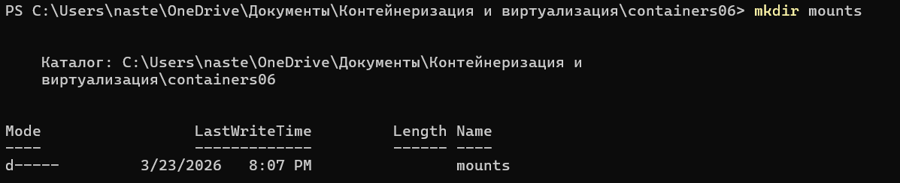
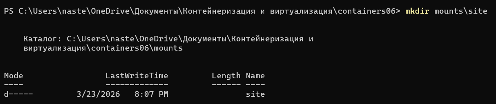
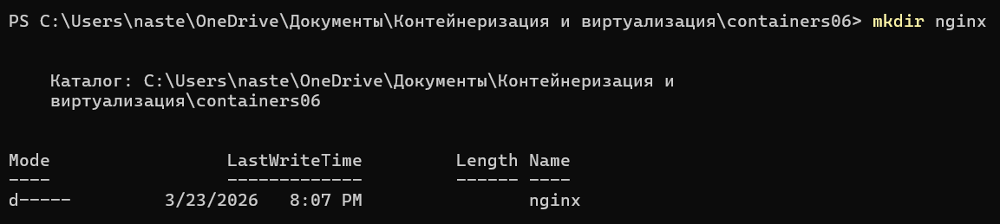
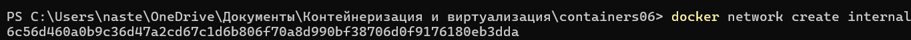
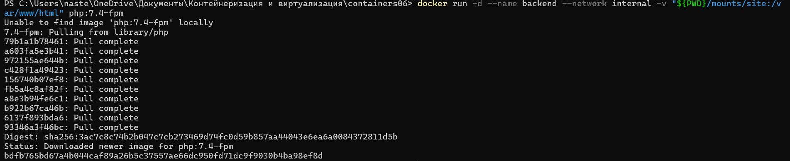
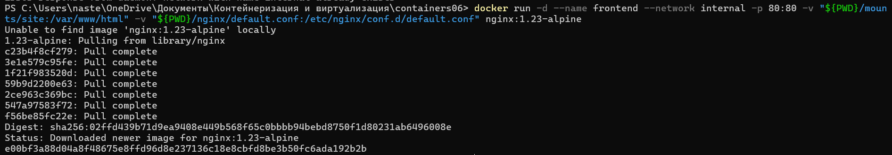
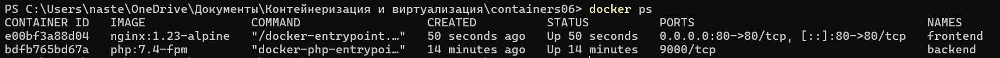
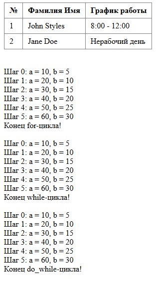

# Лабораторная работа №6: Взаимодействие контейнеров

**Каварналы Анастасия, IA2403** 

**Дата:** 23.03.2026

## Цель работы

Выполнив данную работу студент сможет управлять взаимодействием нескольких контейнеров

## Задание

Создать php приложение на базе двух контейнеров: nginx, php-fpm. Файлы docker-compose для решения лабораторной работы использовать запрещено!

## Подготовка

Для выполнения данной работы необходимо иметь установленный на компьютере Docker

- Для подтверждения корректной установки и работы Docker выполнена команда

```powershell
docker --version 
docker ps
```


## Ход работы

### 1. Был создан репозиторий `containers06`. После этого проект был размещен на локальном компьютере в рабочей директории:

`C:\Users\naste\OneDrive\Документы\Контейнеризация и виртуализация\containers06`

### 2. В директории `containers06` была создана папка `mounts/site`




В данную папку был помещен PHP-сайт, созданный ранее в рамках предмета по PHP

```php
<?php
$day = date('N');

if ($day == 1 || $day == 3 || $day == 5) {
    $johnSchedule = "8:00 - 12:00";
} else {
    $johnSchedule = "Нерабочий день";
}

if ($day == 2 || $day == 4 || $day == 6) {
    $janeSchedule = "12:00 - 16:00";
} else {
    $janeSchedule = "Нерабочий день";
}
?>

<style>
table {
    border-collapse: collapse;
}
th, td {
    padding: 6px 10px;
    text-align: left;
}
</style>

<table border="1" cellpadding="0" cellspacing="0">
    <tr>
        <th>№</th>
        <th>Фамилия Имя</th>
        <th>График работы</th>
    </tr>
    <tr>
        <td>1</td>
        <td>John Styles</td>
        <td><?= $johnSchedule ?></td>
    </tr>
    <tr>
        <td>2</td>
        <td>Jane Doe</td>
        <td><?= $janeSchedule ?></td>
    </tr>
</table>

<?php

echo "<br><br>";

$a = 0;
$b = 0;

for ($i = 0; $i <= 5; $i++) {
    $a += 10;
    $b += 5;
    echo "Шаг $i: a = $a, b = $b <br>";
}

echo "Конец for-цикла! <br><br>";


$a = 0;
$b = 0;
$i = 0;

while ($i <= 5) {
    $a += 10;
    $b += 5;
    echo "Шаг $i: a = $a, b = $b <br>";
    $i++;
}

echo "Конец while-цикла! <br><br>";


$a = 0;
$b = 0;
$i = 0;

do {
    $a += 10;
    $b += 5;
    echo "Шаг $i: a = $a, b = $b <br>";
    $i++;
} while ($i <= 5);

echo "Конец do_while-цикла! <br><br>";
?>
```

### 3. В корне проекта был создан файл `.gitignore`, в который были добавлены строки:

```gitignore
# Ignore files and directories
mounts/site/*
```

Данный файл нужен для того, чтобы содержимое папки `mounts/site` не отслеживалось системой контроля версий Git

### 4. В проекте был создан файл `nginx/default.conf`



В него была добавлена следующая конфигурация:

```nginx
server {
    listen 80;
    server_name _;
    root /var/www/html;
    index index.php;
    location / {
        try_files $uri $uri/ /index.php?$args;
    }
    location ~ \.php$ {
        fastcgi_pass backend:9000;
        fastcgi_index index.php;
        fastcgi_param SCRIPT_FILENAME $document_root$fastcgi_script_name;
        include fastcgi_params;
    }
}
```

Данный конфигурационный файл нужен для настройки веб-сервера `nginx`. Он указывает:

- что сервер слушает порт `80`;
- что корневая директория сайта находится в `/var/www/html`;
- что стартовым файлом является `index.php`;
- что PHP-файлы должны передаваться на обработку в контейнер backend по порту `9000`

### 5. Для организации взаимодействия контейнеров была создана сеть `internal`

```powershell
docker network create internal
```



Сеть `internal` необходима для того, чтобы контейнеры `frontend` и `backend` могли взаимодействовать друг с другом по имени контейнера

### 6. Был создан контейнер `backend` со следующими свойствами:

- на базе образа `php:7.4-fpm`;
- к контейнеру примонтирована директория `mounts/site` в `/var/www/html`;
- работает в сети `internal`

Контейнер `backend` отвечает за выполнение PHP-кода

```powershell
docker run -d --name backend --network internal -v "${PWD}/mounts/site:/var/www/html" php:7.4-fpm
```



### 7. После этого был создан контейнер `frontend` со следующими свойствами:

- на базе образа `nginx:1.23-alpine`;
- с примонтированной директорией `mounts/site` в `/var/www/html`;
- с примонтированным файлом `nginx/default.conf` в `/etc/nginx/conf.d/default.conf`;
- порт 80 контейнера проброшен на порт 80 хоста;
- работает в сети `internal`

Контейнер `frontend` отвечает за прием HTTP-запросов от браузера и передачу PHP-файлов в контейнер backend для обработки

```powershell
docker run -d --name frontend --network internal -p 80:80 -v "${PWD}/mounts/site:/var/www/html" -v "${PWD}/nginx/default.conf:/etc/nginx/conf.d/default.conf" nginx:1.23-alpine
```



### 8. После запуска контейнеров была выполнена команда:

```powershell
docker ps
```

В результате было подтверждено, что оба контейнера успешно работают:

- backend
- frontend

Это означает, что контейнеры были корректно созданы и подключены к сети `internal`



### 9. Для тестирования проекта в браузере был выполнен переход по адресу:

`http://localhost`

В результате в браузере открылся PHP-сайт. На странице корректно отобразились таблица сотрудников и результаты выполнения циклов

Это подтверждает, что:

- `nginx` принимает запросы от браузера;
- `php-fpm` корректно обрабатывает PHP-код;
- папка сайта успешно примонтирована в оба контейнера;
- взаимодействие контейнеров настроено правильно



## Контрольные вопросы

1. Каким образом в данном примере контейнеры могут взаимодействовать друг с другом?

Контейнеры могут взаимодействовать друг с другом, потому что они подключены к одной сети `internal`. Контейнер `frontend` через `nginx` передает обработку PHP-файлов контейнеру `backend`, где работает `php-fpm`

2. Как видят контейнеры друг друга в рамках сети `internal`?

Внутри сети `internal` контейнеры видят друг друга по именам контейнеров. Поэтому `nginx` обращается к PHP-контейнеру по имени `backend` и `порту 9000`

3. Почему необходимо было переопределять конфигурацию `nginx`?

Конфигурацию `nginx` нужно было переопределить, чтобы указать путь к сайту, главный файл `index.php` и правило передачи PHP-файлов в контейнер `backend`. Без этого `nginx` открыл бы стандартную страницу или не смог бы обработать PHP

## Вывод

В ходе лабораторной работы было создано и настроено PHP-приложение на базе двух контейнеров Docker: `nginx` и `php-fpm`. В процессе работы была создана сеть `internal`, настроено монтирование файлов сайта и конфигурации `nginx`, после чего контейнеры были успешно запущены и проверены. В результате сайт корректно открылся в браузере по адресу `http://localhost`, что подтвердило правильную настройку взаимодействия контейнеров без использования `docker-compose`.

## Используемые источники

1. [Moodle](https://elearning.usm.md/course/view.php?id=6806)
2. [ChatGPT](https://chatgpt.com/)
3. [Docker CLI Reference — `docker run`](https://docs.docker.com/reference/cli/docker/container/run/)
4. [Docker Hub — официальный образ `php`](https://hub.docker.com/_/php)
5. [Docker Hub — официальный образ `nginx`](https://hub.docker.com/_/nginx)
6. [Docker CLI Reference — `docker network create`](  https://docs.docker.com/reference/cli/docker/network/create/)